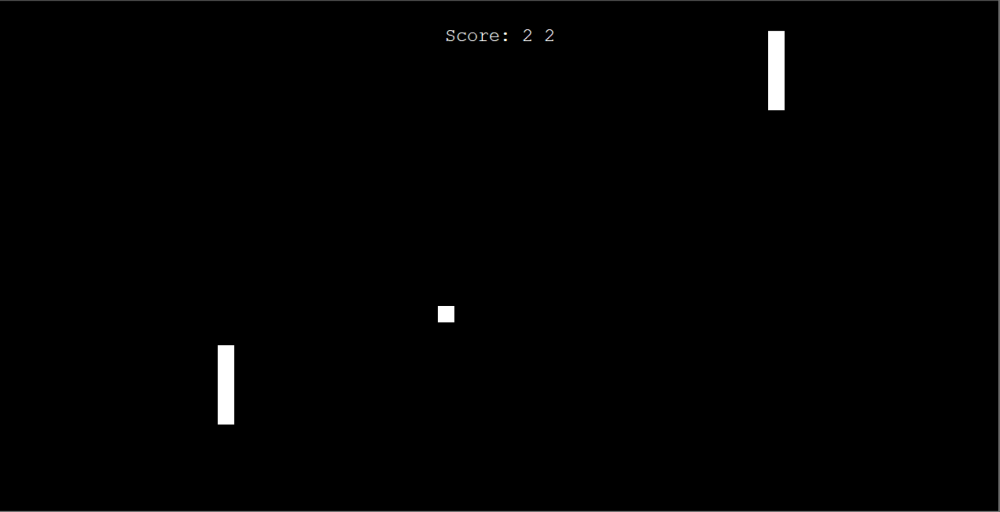

# Pong

## Table of Contents
1. [URL](#url)
2. [Description](#description)
3. [Installation](#installation)
4. [Usage](#usage)
5. [Credits](#credits)

## URL 

Due to the nature of this project, the code has not been deployed. However, the repository can be found at https://github.com/Spacepineapple/pong

## Description 

This is a fully playable game of Pong built in Python using the Turtle graphics package with support for two players. Using the up and down arrow keys, the player on the right can move their paddle up and down, while the player on the left can move their paddle by using the W and S keys. As the players successfully hit the ball, it will speed up and will continue to move at a faster speed until the ball moves out of play. If a player fails to hit the ball before it reaches their side of the screen, their opponent will gain a point with points visible at the top of the screen. An example of the game window can be seen below:

## Installation 

To install the game, simply download the repository and unzip the files. Please note that the game requires installation of Python.

## Usage 

To play the game, first download the files from the repository and unzip them. Navigate to the repository and run main.py. Following this, the game window should load and the player will be able to see the two paddles and the ball. The ball will move on its own, but the players must use the W and D keys and the up and down arrow keys for the players on the left and right respectively. The aim of the game is to hit the ball before it reaches your side of the screen and to prevent your opponent from hitting the ball back. Whoever earns the highest score is the winner!

## Credits 

This project was built by myself. The project idea and code was based on an activity in Dr Angela Yu's 100 Days of Code course on Udemy.